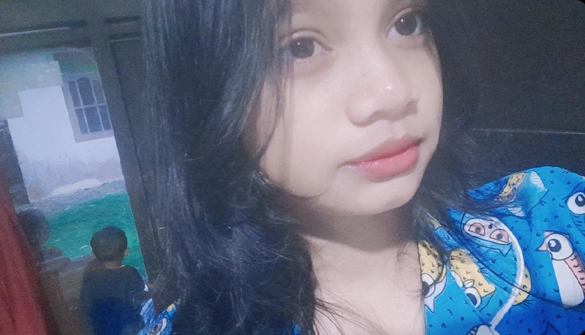

<!DOCTYPE html>
<html lang="id">
<head>
    <meta charset="UTF-8">
    <meta name="viewport" content="width=device-width, initial-scale=1.0, maximum-scale=1.0, user-scalable=no">
    <title>🎂 HBD Sayangku ❤️</title>
    <link rel="stylesheet" href="https://cdnjs.cloudflare.com/ajax/libs/font-awesome/6.0.0-beta3/css/all.min.css">
    <link href="https://fonts.googleapis.com/css2?family=Fredoka+One&family=Nunito:wght@400;600;700;800;900&family=Dancing+Script:wght@400;700&display=swap" rel="stylesheet">
    
</head>
<body>

    <!-- Background Emoji Jatuhan -->
    

    <!-- Card Utama -->
    

        <!-- HALAMAN 1: Pembuka -->
        

            

                <i class="fas fa-heart"></i>
                HAI MANISS
                <i class="fas fa-heart"></i>
            

            

                <i class="fas fa-arrow-right"></i> TOLONG DI BACA YA <i class="fas fa-arrow-left"></i>
            

            

                <button class="btn-slime" id="btnNext1">
                    <i class="fas fa-arrow-right"></i> SELANJUTNYA
                </button>
            

        

        <!-- HALAMAN 2: Amplop -->
        

            

                <i class="fas fa-gift"></i>
                UNTUK MU
                <i class="fas fa-heart"></i>
            

            

                HARAP DI BUKA YA CANTIK 😘🥰
            

            <!-- Amplop Melayang -->
            

                

                    ❤️
                    💖
                    💗
                    💕
                    ⭐
                    ✨
                    

                    💌
                

            

            <!-- ISI AMPLOP -->
            

                

                    
                

                

                    <button class="close-btn" id="closeLetter">✕ TUTUP</button>
                    

                        HBBBDDD SAYANGGG 🎂❤️ 
                        SEMOGAAA KAMU PANJANG UMUR, SEHAT SELALU, DI MUDAHKAN REJEKINYA, BERBAKTI KEPADA ORANG TUA, MAKIN PINTAR, SUKSES DUNIAA AKHIRATT. 
                        DAN HUBUNGAN KITAA LANGGENGG TERUSS YAA SAYANGG CANTIK CINTAAA KUU KASIHH KUU 😘🥰🥰 
                        HBBDDD POKONYA CINTAAA. 💖🎉
                        F4T4N 4You
                    

                    

                        💌 Surat sudah ditutup 💌
                    

                

            

            

                <button class="btn-slime" id="btnNext2" style="font-size:1.1rem; padding:0.6rem 1.8rem;">
                    <i class="fas fa-arrow-right"></i> SELANJUTNYA
                </button>
            

        

        <!-- HALAMAN 3: Kuis & Musik -->
        

            

                <i class="fas fa-gamepad"></i>
                KUIZZ CINTA
                <i class="fas fa-heart"></i>
            

            

                <i class="fas fa-question-circle"></i> TEBAK² DRAMATIS <i class="fas fa-question-circle"></i>
            

            

                
            

            

                
💿

                <i class="fas fa-music"></i> Putar Lagu
            

            

                
Apa yang paling kamu suka dari aku?

                

                    
❤️ Kebaikan hatimu

                    
😅 Kekocakanmu

                    
😏 Kejahilanmu

                    
🤔 Semua salah

                

                

                

                    <button class="btn-small" id="btnNextQuiz">Selanjutnya →</button>
                

            

            

                <button class="btn-small" id="btnFinish" style="font-size:1rem; padding:0.5rem 1.5rem;">🎉 Selesai</button>
            

        

    

    <audio id="bgMusic" loop style="display:none;">
        <source src="kamu7.mp3" type="audio/mp3">
    </audio>

    

</body>
</html>
